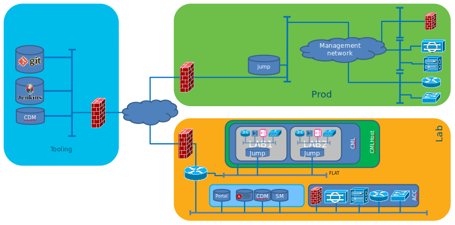
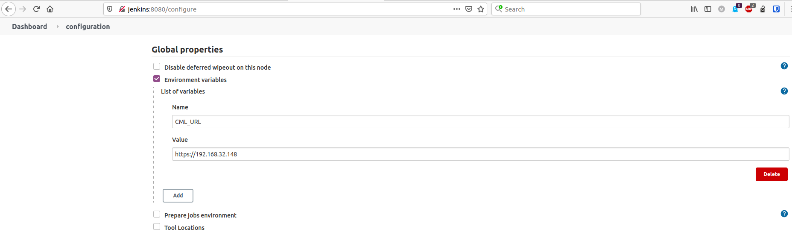
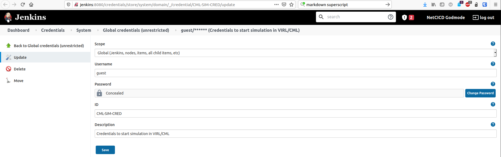

[](https://depshield.github.io)
[](https://developer.cisco.com/codeexchange/github/repo/Devoteam/CICD-toolbox)

# Background
When working on [NetCICD](https://github.com/Devoteam/NetCICD), again and again, tools used changed their way of use. In addition, additional functionality was needed: some sort of SSO, Jupyter Notebook, Node Red, git, etc. Adding more tools made the tool chain more brittle every time. And what was worse: building it using VM ate CPU and memory, basically limiting the size of the simulations that can be done. In short: having a dependable pipeline is one complex thing, making sure it keeps on working is another.

With the advent of [Cisco Modeling Labs](https://www.cisco.com/c/en/us/products/cloud-systems-management/modeling-labs/index.html) replacing VIRL, a new piece of the puzzle needed to be changed.

With the amazing team of DevOps specialists at Devoteam, we started to develop a basic devops toolchain, containing most things you might need to get started on the click of a button. It is pre-configured and can be used to jumpstart a NetCICD project and based upon Docker to minimise the footprint on a local machine. 

Tooling only has to make your life easier, after all Tech is for People, not the other way around. This is the place where we do this. We are far from finished. Feel free to contribute.

# Want we want to achieve
Having a well functioning tool chain can save a lot of time. But automation is also the fastest way to destroy your business. That is why we want to build a setup that is predictable and reliable:



As you can see, the tool chain is separated from the managed environments. This allows to use a single toolset for all environments. 

In every environment you'll see a jump host. This jump host is the only system that can connect back to the tool chain. It is controlled from Jenkins.

By default, a setup that links to a local [CML Personal edition](https://learningnetworkstore.cisco.com/cisco-modeling-labs-personal/cisco-cml-personal) is included, the Netcicd Pipeline. if CML is installed on the same machine as the toolbox is installed upon, Jenkins starts a lab and configures the nodes of the first stage.
### With updates on the refplat ISO in CML, you might find that some labs do not start anymore. We do try to keep things running and up-to-date, but the version difference between the Cisco CML sandbox and the latest version of CML and the refplat ISO MAY cause the labs from booting. We did try to prevent this by removing versions from the cml file, but we have occasionally encountered failing labs. 

For more information on the systems used and the setup of the individual systems, look at the wiki.

# How to install

### Work in progress!!
Even though we try to make this work as well as we can, it is being improved daily. Master should work, Develop is the most complete.
## Local installation
The local install is tested on a setup on an Ubuntu machine with VMWare Workstation installed. 

### Network settings
A vmnet1 host-only network is defined with network 10.10.20.0/24. You should be using the local address 10.10.20.50 [on VMware WS](https://linuxhint.com/configure-dhcp-server-vmware-workstation-pro-16/#5) in order for the toobox to work and to be compatible with the sandbox. Use 
### sudo ip a replace 10.10.20.50 dev vmnet1 ###

if it does not work

The CML host should run on 10.10.20.161, just like on the Cisco Devnet Sandbox.

### Software configuration

The setup has been developed and tested on a fully updated Ubuntu 20.04.1 minimal install, 30 GB disk, 2 CPU, 16 GB memory on KVM with Internet access. As the setup also uses local networking, using the Ubuntu Desktop version is easier. During install testing the minimal install is used. 

As the last part of the install uses Robotframework with Selenium, it requires a decent screen resolution. Make sure you have at least 1200 pixels in height, otherwise the finalize install script may fail. I am switching to Terraform to install the systems.

After install, execute:

```sudo wget -O- https://apt.releases.hashicorp.com/gpg | sudo gpg --dearmor -o /usr/share/keyrings/hashicorp-archive-keyring.gpg```

```echo "deb [signed-by=/usr/share/keyrings/hashicorp-archive-keyring.gpg] https://apt.releases.hashicorp.com $(lsb_release -cs) main" | sudo tee /etc/apt/sources.list.d/hashicorp.list```

```sudo apt-get update && sudo apt-get upgrade -y```

```sudo apt -y install openjdk-11-jre-headless maven git docker.io docker-compose curl python3 python3-pip python-is-python3 jq vim firefox xauth libgl1-mesa-glx libcanberra-gtk-module libcanberra-gtk3-module libegl1 iputils-ping make build-essential wget terraform vault```

```sudo curl -L "https://github.com/docker/compose/releases/download/1.27.4/docker-compose-$(uname -s)-$(uname -m)" -o /usr/local/bin/docker-compose```

```sudo usermod -aG docker ${USER}```

```sudo su - ${USER}```

```sudo python3 -m pip install robotframework```

```sudo python3 -m pip install robotframework-selenium2library```

```echo "export COMPOSE_DOCKER_CLI_BUILD=1" >> ~/.bashrc```

Go to the [Trivy site](https://aquasecurity.github.io/trivy/v0.31.3/getting-started/installation/) to install trivy.

Install [Docker Buildkit](https://docs.docker.com/build/buildkit/#getting-started):

```sudo vi /etc/docker/daemon.json``` and paste:

```
{
  "features": {
    "buildkit": true
  }
} 
```

Reboot to make sure all changes are activated.

Install the [CICD-toolbox](https://github.com/Devoteam/CICD-toolbox):

```git clone https://github.com/Devoteam/CICD-toolbox.git```

```cd CICD-toolbox/```

```sudo cp geckodriver /usr/local/bin/```

### As Docker has a pull rate limit, you need to authenticate first:
```docker login -u <yourusername> -p <yourpassword>```

It seems there are issues with robotframework and selenium 4.10+ which make the vault install fail. use 

```pip install selenium==4.9.1``` to fix this

It also requires buildkit to be active to enable [see the docker site](https://docs.docker.com/build/buildkit/#getting-started)

After this, you can run:

```./runonce ```

You need to be able to run docker as non-root. See [here](https://docs.docker.com/engine/install/linux-postinstall/) for details.

### Do NOT run this script after use.
* The script stops all existing containers
* It wipes all working directories, networks, containers and builds
* Networks are preconfigured to enable the connect-back from CML
* Running or starting twice will create failing networks and/or containers, duplicate IP addresses and all kinds of other mayhem.

## Cisco Devnet Sandbox use
You should be able to run the lab in a Cisco Devnet Sandbox. Install takes abount 1 hour due to CPU limitations.

* Go to: [the Devnet Sandbox](https://devnetsandbox.cisco.com/RM/Diagram/Index/685f774a-a5d6-4df5-a324-3774217d0e6b?diagramType=Topology) and log in with the credentials of your choice.
* clone this repo: git clone https://github.com/Devoteam/CICD-toolbox.git
* Go to the repo: cd CICD-toolbox
* Run the startup script: ./runonce-devnet-sandbox.sh

You need to have a local reference to Keycloak and the other systems by name. Run the **devnet-sandbox-reachability.sh** script to accomplish this (the script is designed for use in Ubuntu Linux, there are no plans to add other versions). 

If all goes well, it installs the containers and you are **almost** good to go. In order to make everything work properly, get the rdp session going and execute the robot script:

robot -d install_log/ finalize_install.robot

to configure all kinds of default passwords. If everything works as designed, you should see browsers popping up, opening Jenkins, Gitea and Keycloak for the creation of the required keys and tokens. 

All steps should PASS!

If you now log into Jenkins, you should see Jenkins scanning Gitea, finding two repositories, and starting a test on NetCICD. At the moment this lab fails. It is most probably due to having incorrect IP addresses in the NetCICD_agent. We are working on a fix.

## Users ##
All users are configured in Keycloak. [The wiki](https://github.com/Devoteam/CICD-toolbox/wiki/Users-and-passwords) has the complete list.

### Wat the Robot script does ###
In order for Jenkins to be able to run the jenkinsfiles, jenkins needs the jenkins-jenkins user to have a token.

* Go to http://jenkins:8080/user/jenkins-jenkins/configure (jenkins-jenkins/netcicd). 
* Add the token. Copy this token, and paste it into a temporary file. Log out.
* Go to http://jenkins:8080/credentials/store/system/domain/_/credential/jenkins-jenkins/update (netcicd/netcicd)
* Click Change Password and paste the token there. Delete the temporary file.

In order for Jenkins to be able to scan git, the git-jenkins users needs to log in once.

* Go to http://gitea:3000/user/login?redirect_to=%2f
* Log in as (git-jenkins/netcicd) and set the password. You must use the same password as used in Jenkins Credentials git-jenkins. Use something safe.

## About Cisco Modeling Labs installation ##
### Reachability ###
The pipeline is initially developed to work with Cisco Modeling Labs Personal Edition, but will work with any Jenkinsfile you feed the pipeline. In order to work with CML PE, you can use a stock install, but it needs a fixed IP address. The address configured in the pipeline is 192.168.32.148. If you used a different address, you need to change this in [Jenkins](http://jenkins:8080/configure), look for Global Properties and change the IP address at CML-URL.



### User ###
The default username/password for CML is guest/guest as it was in VIRL. With CML<sup>2</sup>, this is no longer accepted, and needs to be changed. As explained after install, this must be done in Jenkins. Go to [Jenkins Credentials ->CML-SIM-CRED](http://jenkins:8080/credentials/store/system/domain/_/credential/CML-SIM-CRED/update) and change the credentials to thos you use to log in to CML<sup>2</sup>.



# License #
This Source Code Form is subject to the terms of the Mozilla Public License, v. 2.0. If a copy of the MPL was not distributed with this file, You can obtain one at http://mozilla.org/MPL/2.0/.
## Copyright ##
(c) Mark Sibering

